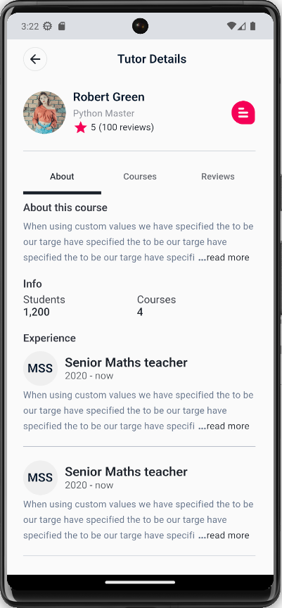

# studdy

Studdy is a mobile application designed to address the lack of easily accessible and tailored study materials for the Kenyan new Competency-Based Curriculum (CBC) education system, particularly at the high school level. This project utilizes Docker containers for development and deployment and follows the MVC (Model-View-Controller) architecture. The app is developed using Flutter for the frontend and Java for backend services.

## Problem Statement

The Kenyan education system has recently transitioned to the Competency-Based Curriculum (CBC), which presents a need for up-to-date and centralized study materials. The lack of easily accessible resources tailored to this curriculum, especially at the high school level, hinders students' ability to effectively prepare for their studies. Studdy aims to solve this problem by providing a user-friendly platform that offers a comprehensive collection of study materials, catering to the specific requirements of the CBC curriculum.

## Assumptions

The development timeline for this project will be reasonable, with the assumption that the team (its a solo project🙃...its not ideal but its what i've got) has a clear understanding of the requirements and a well-defined plan in place.(i just have the end goal of what the app should look, feel and function like... again not ideal but...)

## Prerequisites


Before getting started with the development and deployment of Studdy, ensure the following prerequisites are met:

- Dart 3: Dart is the programming language used by Flutter for building cross-platform applications. Ensure that Dart 3 is installed on your development environment.

- Java 17: The backend services of the app are developed using Java. Make sure Java 17 is installed and configured correctly.

## Getting Started


Follow these steps to set up the project and start development:

1. **Clone the Repository**: Begin by cloning this repository to your local development machine.

   ```bash
   git clone https://github.com/qarani-m/studdy.git
   cd studdy-app

## Screenshots





## Auth Flow of events
Couldn't draw any other UML diagram, so.....🙃


